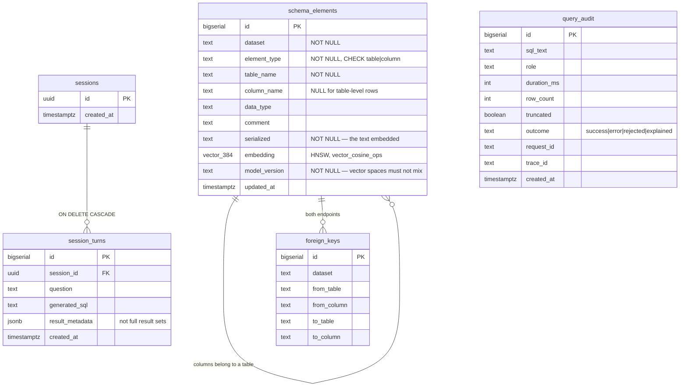

# Database

> **Status: built, except the pictures and the plans.** Both schemas, all five `agent_meta` tables, the indexes and the read-only role are deployed by the migrations, and §3, §5 and §7 track them column for column. **Still open:** the ER diagram (§2) and the `EXPLAIN ANALYZE` work in §9, which needs a corpus larger than a benchmark database.

PostgreSQL 16+ with the `pgvector` extension.

---

## 1. Two schemas, two purposes

The database holds two distinct things, and keeping them separate matters:

| Schema | Contents | Owner | Accessed by |
|---|---|---|---|
| `public` (or per-dataset) | **Target data** — the tables users ask questions about | dataset owner | `execute_sql`, read-only role |
| `agent_meta` | **Catalog and embeddings** — schema elements, vectors, session state, audit log | app owner | retrieval + agent, app role |

The agent's own metadata must never be reachable from generated SQL. The read-only role is granted `SELECT` on the target schema and **nothing** on `agent_meta`. A question that tries to read the audit log fails at the permission boundary, not at a prompt.

## 2. ER diagram

> **Committed 2026-08-11 as Mermaid rather than as `docs/assets/er-diagram.png`.** A binary image cannot be diffed, so a schema drawing that stops matching `migrations/` changes silently. This one is text in the file it documents and shows up in a pull request next to the migration that invalidates it.

**`agent_meta` — the project's own tables.** `migrations/versions/001_extensions_and_agent_meta.py` and `003` are the authority; this matches them.



**`query_audit` is deliberately absent from that graph, and its absence is the design.** It carries no foreign key to `sessions`, because **the audit trail must survive session deletion** — a table joined to the thing it audits is a table that can be erased by erasing the thing it audits.

**The target dataset has no diagram here and will not get one.** It is whichever schema an operator loaded — for the benchmark, one of twenty Spider databases — so it is generated per-dataset by introspection rather than hand-drawn. `PostgresIntrospector` reads it from `pg_catalog` at index time.

## 3. Tables (`agent_meta`)

**Built** — `migrations/versions/001_extensions_and_agent_meta.py` is the authority. The shapes below match what is deployed, column for column.

### `schema_elements`
One row per table or column in the target schema — the retrieval corpus.

| Column | Type | Notes |
|---|---|---|
| `id` | `bigserial` PK | |
| `dataset` | `text` | Which target database this belongs to |
| `element_type` | `text` | `table` \| `column`, CHECK-constrained |
| `table_name` | `text` | |
| `column_name` | `text` | NULL for table-level rows |
| `data_type` | `text` | |
| `comment` | `text` | From `pg_description` where present |
| `serialized` | `text` | The text actually embedded — see below |
| `embedding` | `vector(384)` | Dimension follows the model; see [../ml/TRAINING.md](../ml/TRAINING.md) |
| `model_version` | `text` | Which retriever produced this vector |
| `updated_at` | `timestamptz` | |

`serialized` is the interesting field: retrieval quality depends on what text gets embedded. `src/schema/serialization.py` builds `"{table}.{column} ({type}) — {comment}. Examples: {v1}, {v2}, {v3}"` for columns and `"{table} (table) — {comment}. Columns: a, b, c, and N more"` for tables, so type, comment and representative values contribute to the match rather than the name alone. Whether the examples earn their place is an ablation nobody has run — Stage 5.

`model_version` is not optional bookkeeping — vectors from the baseline and fine-tuned models are **not comparable**, so mixing them silently corrupts retrieval. Queries filter on it.

### `foreign_keys`
Join paths between tables. Returned alongside retrieval results so the model does not have to guess the join condition.

### `sessions` / `session_turns`
Session memory: question, generated SQL, result metadata (not full result sets), timestamps.

### `query_audit`
Append-only. Every statement that reached the executor: SQL text, role, duration, row count, truncation flag, outcome, request/trace ID. See [../operations/SECURITY.md](../operations/SECURITY.md).

`outcome` is one of `success`, `error`, `rejected` (validation refused it) or **`explained`** — a query the caller asked about with `explain_only` and which therefore never ran. Audited like any other, because a caller probing the schema through repeated validation failures would otherwise leave no trail at all, and the difference between a control and a control you can detect being tested is exactly that trail.

## 4. Relationships

- `schema_elements` — self-referential via `table_name` (columns belong to tables).
- `foreign_keys` → `schema_elements` on both endpoints.
- `session_turns` → `sessions`, `ON DELETE CASCADE` (deleting a session discards its memory).
- `query_audit` → deliberately **not** foreign-keyed to `sessions`. The audit trail must survive session deletion.

## 5. Indexes

| Table | Index | Purpose |
|---|---|---|
| `schema_elements` | HNSW on `embedding` (`vector_cosine_ops`) | ANN retrieval |
| `schema_elements` | btree on `(dataset, model_version)` | Keeps vector spaces from mixing — but see below, it does not filter *before* the ANN scan |
| `schema_elements` | btree on `(dataset, table_name)` | `table_filter` lookups, profiling |
| `foreign_keys` | btree on `(dataset, from_table)` | Join-path expansion |
| `session_turns` | btree on `(session_id, created_at)` | Session replay |
| `query_audit` | btree on `created_at`, `request_id` | Incident lookup |

**HNSW vs IVFFlat:** HNSW is used — better recall at a given latency, no training step, and this corpus is small enough (thousands of elements, not millions) that build time and memory are not a concern. Revisit only if a target schema is unexpectedly enormous. Recorded in [DECISIONS.md](DECISIONS.md).

### 5.1 The `(dataset, model_version)` filter is a post-filter, and that starves the scan

This page previously described the filter as running "before ANN". It does not, and the difference is not academic.

`EXPLAIN` shows the predicate as a `Filter` applied to rows the HNSW index scan has **already returned**. With pgvector's default `hnsw.iterative_scan = off` the scan stops once its candidate list is exhausted, so a filter that discards most candidates leaves fewer than `k` rows — with no error, no warning, and a perfectly ordinary-looking result.

Measured on PostgreSQL 16 / pgvector 0.8.5, two datasets of 5,000 elements each:

| `k` | `ef_search` | `iterative_scan=off` | `iterative_scan=relaxed_order` |
|---|---|---|---|
| 10 | 40 | **6 rows** | 10 rows |
| 50 | 50 | **8 rows** | 50 rows |
| 50 | 200 | **32 rows** | 50 rows |

It gets worse when the filter *correlates with position in vector space* — which is the normal case, not the exotic one, because a second dataset has its own vocabulary and a re-index under a new `model_version` puts a whole second corpus in its own region. On a corpus shaped that way the default returned **0 of 10 rows**.

Two consequences worth internalising:

- **Fewer candidates is lower Recall@k, and Recall@k is the ceiling on execution accuracy.** This failure attacks the project's primary metric while looking like nothing at all.
- **Random test vectors will never find it.** They interleave datasets uniformly, so every candidate set is ~50% survivors and nothing starves. The regression test therefore builds a corpus where the two datasets use deliberately different vocabularies.

`SchemaRetriever` sets `hnsw.iterative_scan = relaxed_order` per search (`relaxed_order` rather than `strict_order` because results are re-sorted by score in Python anyway, and it is the cheaper of the two). The scan stays bounded by pgvector's own `hnsw.max_scan_tuples`. On pgvector older than 0.8 the setting does not exist; the retriever detects that via `pg_settings` and logs a warning rather than silently degrading.

## 6. Constraints

- `element_type` CHECK to `('table','column')`.
- `NOT NULL` on `dataset`, `element_type`, `table_name`, `serialized`, `model_version`.
- `UNIQUE NULLS NOT DISTINCT (dataset, table_name, column_name, model_version)` — prevents duplicate embeddings for one element under one model, which would skew retrieval scores.

  `NULLS NOT DISTINCT` (PostgreSQL 15+) is load-bearing, not decoration. A *table* element has no column, so `column_name` is `NULL`, and under the default `NULLS DISTINCT` two such rows never conflict — the constraint would permit unlimited duplicate table rows and `INSERT ... ON CONFLICT` would never fire for them. Migration 003 corrects this; migration 001 had the plain form.
- `vector(384)` fixes the dimension; a model change with a different dimension is a migration, not a config toggle.

## 7. Read-only role

The outermost containment boundary. It holds even if prompt defences, AST validation, and every other layer fail — which is why it is the layer to get right first.

**Built** — `migrations/versions/002_readonly_role.py` is the authority; the DDL below is that migration in readable form.

```sql
CREATE ROLE sql_agent_ro NOLOGIN;

REVOKE ALL ON DATABASE analytics FROM PUBLIC;
REVOKE ALL ON SCHEMA public FROM PUBLIC;

GRANT CONNECT ON DATABASE analytics TO sql_agent_ro;
GRANT USAGE  ON SCHEMA public       TO sql_agent_ro;
GRANT SELECT ON ALL TABLES IN SCHEMA public TO sql_agent_ro;

ALTER DEFAULT PRIVILEGES IN SCHEMA public
  GRANT SELECT ON TABLES TO sql_agent_ro;

-- agent_meta is NOT granted. Generated SQL cannot reach it.

ALTER ROLE sql_agent_ro SET statement_timeout = '30s';
ALTER ROLE sql_agent_ro SET idle_in_transaction_session_timeout = '10s';
ALTER ROLE sql_agent_ro SET default_transaction_read_only = on;
ALTER ROLE sql_agent_ro SET work_mem = '32MB';

CREATE ROLE sql_agent_login LOGIN PASSWORD :'ro_password' IN ROLE sql_agent_ro;
```

Points that matter:

- **`default_transaction_read_only = on`** is belt-and-braces alongside the missing write grants. Two independent mechanisms, both of which must fail for a write to land.
- **`statement_timeout` is set on the role**, not just per-connection. A caller that forgets to set it still gets the ceiling.
- **`idle_in_transaction_session_timeout`** stops an abandoned SSE stream from pinning a connection with an open transaction.
- **`work_mem`** caps per-sort memory so one query with a large sort cannot pressure the whole instance.
- **Functions are not granted.** Without `EXECUTE`, `pg_read_file` and friends are unreachable regardless of what SQL is generated.
- **`ALTER DEFAULT PRIVILEGES`** means a table added later is readable without re-granting — and, importantly, is the only thing that is automatic. Write access never is.

> Verification is a **test**, not an assertion in a doc. [../development/TESTING.md](../development/TESTING.md) §5 specifies negative tests: the read-only role must fail on `INSERT`, `UPDATE`, `DELETE`, `CREATE TABLE`, `COPY ... TO PROGRAM`, and any `agent_meta` read. Thirty of them, and they gate Stage 1 rather than Stage 6.

> **And verification is also a startup assertion, because the tests could not have caught the likelier failure.** Every one of those thirty builds this role from this migration inside a testcontainer. None of them looks at the role a deployment's `DATABASE_RO_URL` actually names — so they prove the DDL above is correct and say nothing about whether the running system connects as it. The check that existed for that compared the two connection strings for inequality, which two spellings of the same superuser pass.
>
> `composition.assert_read_only` now asks PostgreSQL's own privilege functions on first open of the read-only connection, and refuses to hand it out otherwise. It asks rather than attempting a write, because the misconfiguration it catches is exactly the one where a probe `INSERT` would be *accepted*. See [ADR-033](DECISIONS.md#adr-033--the-read-only-role-is-proved-at-startup-by-asking-rather-than-by-writing) and [../operations/SECURITY.md](../operations/SECURITY.md) §13.2.
>
> The two verifications answer different questions and both are needed: the tests ask *does this migration produce a safe role*, the assertion asks *is this process using one*.

## 8. Migrations

Alembic, autogenerate off by default — migrations are written and reviewed by hand because several of them are grant statements Alembic cannot infer.

Rules:
- One logical change per migration; every migration has a working `downgrade()`.
- Role and grant changes live in migrations, not in a README someone runs by hand. Security posture must be reproducible from a clean database.
- Extension creation (`CREATE EXTENSION IF NOT EXISTS vector`) is the first migration.
- Re-embedding after a model change is a **data migration with a new `model_version`**, not an in-place `UPDATE`. Old vectors stay queryable until the new set is verified.

## 9. Query optimization

> **TBD — Stage 6**, with `EXPLAIN ANALYZE` output against real plans.

Planned analysis:

- **ANN recall/latency tradeoff** — HNSW `ef_search` sweep against Recall@k, so the retrieval latency budget in [../operations/PERFORMANCE.md](../operations/PERFORMANCE.md) is a measured choice.
- **~~Pre-filter vs post-filter~~** — measured, and the answer was not the one assumed. Written up in §5.1. What remains open is the *cost* of `iterative_scan = relaxed_order` at a realistic corpus size, and whether `strict_order` is ever worth its price.
- **Connection pool sizing** — `execute_sql` is the contended resource; pool size is what actually bounds concurrent load on the database.
- **The generated-SQL plans themselves** — the `estimated_cost` returned by `validate_sql` gives the agent a bail-out signal before execution. Calibrating the threshold is empirical work, not a guess.
