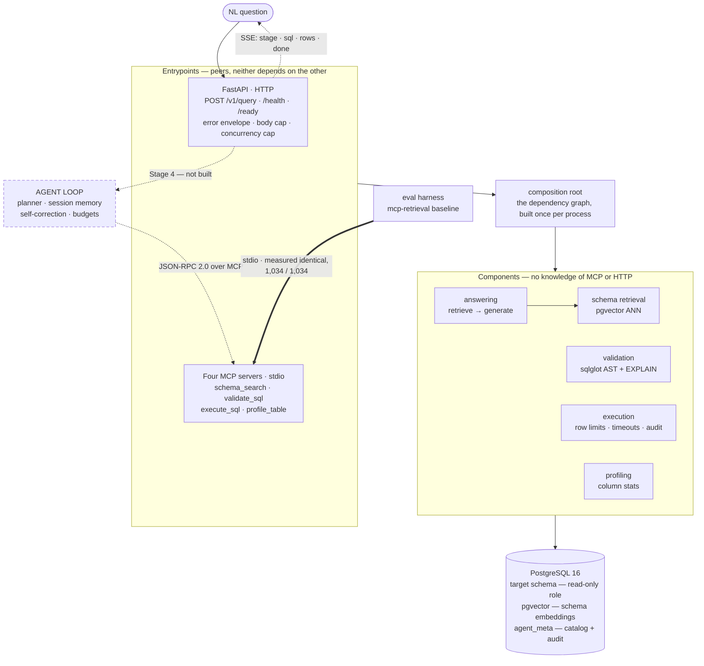
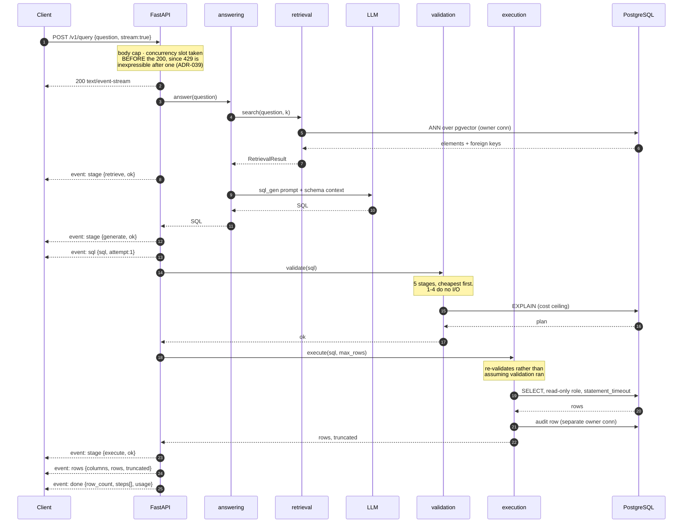
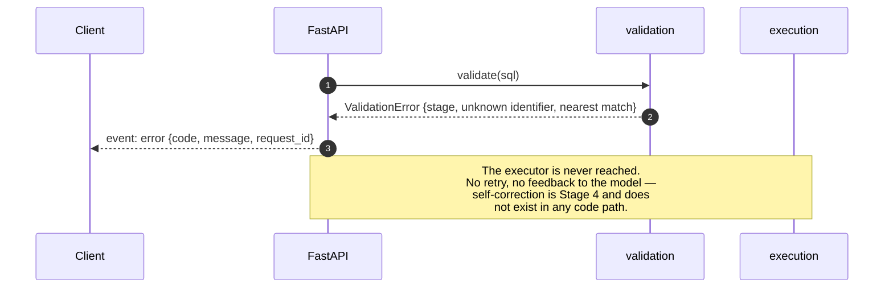

# System Architecture

> **Status: mostly built.** §2.1 (the API layer) is built: probes, the error envelope, the startup assertions, and **`POST /v1/query` in both response shapes** — a question in, SQL and rows out, streamed as `stage`/`sql`/`rows`/`done` events when asked. §2.3–§2.8 describe code that exists. **§2.2 (the agent loop) is the one component still entirely design intent** — its *client* half exists, the loop that drives it does not, so the events in §3.1 that come from *decomposition* (`plan`, `tool_call`, `tool_result`) have nothing behind them yet. **§2.2 is v2.0**, not an unfinished part of v1.0 — the boundary is drawn there in [ROADMAP §Releases](../project/ROADMAP.md#releases). The architecture diagrams are committed as Mermaid rather than as images, so they live in the same diff as the code they describe; two sequence diagrams remain `TBD`. Latency is measured, in [PERFORMANCE.md](../operations/PERFORMANCE.md) §1.
>
> **A browser client exists too, and it is not in the numbered sections below** because it is not a service. `web/` is a static bundle the API can serve; it holds no business logic and reaches nothing but `/v1/query` on its own origin. See §2.11.

---

## 1. Architecture diagram

> **Committed 2026-08-11 as Mermaid rather than as `docs/assets/architecture.png`.** The promise of a PNG stood unfulfilled from Stage 0 through Stage 3, and it was the wrong promise: a binary image cannot be diffed, so a diagram that stops matching the code changes silently and is discovered by a reader. Mermaid renders on GitHub, lives in the file it documents, and shows up in a pull request as text. **Dashed edges are unbuilt.**

**Two entrypoints, one set of components.** The layering is the point: the MCP servers and the HTTP API are *peers*, both thin adapters over the same components, and neither may depend on the other ([ADR-035](DECISIONS.md#adr-035--the-composition-root-is-its-own-package-because-entrypoints-are-peers)).



**Read the dashes.** The agent loop is the only unbuilt box, and everything it would drive already exists — which is why the served path reaches the components **directly** rather than over MCP. That is a composition choice, not an unproven one: the eval harness's `mcp-retrieval` baseline does reach `schema_search` over stdio and returns byte-identical results doing it ([BENCHMARKS §8](../ml/BENCHMARKS.md)). OpenTelemetry spans are designed to wrap every arrow above and **none exist** — nothing under `src/` imports `opentelemetry` ([OBSERVABILITY.md](../operations/OBSERVABILITY.md)).

<details>
<summary>The ASCII version this replaced, kept because it reads without a renderer</summary>


```
                    ┌──────────────────────────────────────┐
   NL question ───▶ │           FastAPI (HTTP)             │ ───▶ SSE progress
                    │  POST /v1/query · /health · /ready   │
                    └───────────────┬──────────────────────┘
                                    │
                    ┌───────────────▼──────────────────────┐
                    │              AGENT                   │
                    │  planner · executor · session memory │
                    │  self-correction loop · budgets      │
                    │        (an MCP *client*)             │
                    └───────────────┬──────────────────────┘
                                    │  JSON-RPC 2.0 over MCP
        ┌───────────────┬───────────┴───────────┬──────────────────┐
        ▼               ▼                       ▼                  ▼
 ┌─────────────┐ ┌─────────────┐        ┌──────────────┐  ┌───────────────┐
 │schema_search│ │validate_sql │        │ execute_sql  │  │ profile_table │
 │             │ │             │        │              │  │               │
 │ retriever   │ │ sqlglot AST │        │ read-only    │  │ column stats  │
 │ + pgvector  │ │ + EXPLAIN   │        │ role, limits │  │ sample rows   │
 └──────┬──────┘ └──────┬──────┘        └──────┬───────┘  └───────┬───────┘
        │               │                      │                  │
        └───────────────┴──────────┬───────────┴──────────────────┘
                                   ▼
                    ┌──────────────────────────────────────┐
                    │            PostgreSQL 16             │
                    │  target schema (read-only role)      │
                    │  pgvector: schema embeddings         │
                    └──────────────────────────────────────┘

   OpenTelemetry spans are *designed* to wrap every arrow above. None exist:
   nothing under src/ imports opentelemetry. See OBSERVABILITY.md.
```

**Two things in that picture are design intent rather than code, and the ASCII drawing cannot show the difference** — which is the specific reason it was replaced. The **agent** box is unbuilt: its MCP *client* half exists, the loop that drives it does not (§2.2), so the served path runs API → answering → validation → execution. And the tracing line is a plan; the pins for it are in `requirements.txt` with no importer. The Mermaid version above draws both as dashed edges, so a reader who does not get to this paragraph is not misled by the picture.

</details>

## 2. Components

### 2.1 API layer (FastAPI)

Thin. Accepts a question, opens an SSE stream, delegates to the agent, streams progress events, returns the final answer. Holds no business logic — everything meaningful is in the agent or behind an MCP boundary, so the same agent runs unchanged when an MCP host drives it instead of HTTP.

Responsibilities: request validation, session correlation, SSE framing, rate limiting, health/readiness probes.

**Built:** `create_app()`, `GET /health`, `GET /ready`, **`POST /v1/query` streaming and non-streaming**, SSE framing, the error envelope, request correlation, the body cap, the concurrency cap (taken *before* a stream begins, since a `429` is not expressible after a `200` — [ADR-039](DECISIONS.md#adr-039--a-stream-is-admitted-before-it-is-a-stream)) and the read-only pool. **Not built:** sessions, authentication, and the four event types that come from the agent loop. [API.md](API.md) carries the per-route table.

This is the project's **first surface reachable by someone who does not already have the machine** — every other component runs as a local process an operator started, so "who can call this" was answered by the operating system. Three consequences shape the layer rather than sit beside it:

| Property | Why it is a property of this layer specifically |
|---|---|
| **Startup either proves the deployment is safe or the process does not start** | The lifespan opens every dependency eagerly. Opening the read-only connection runs `assert_read_only` (§2.5), so a configuration error is a failed deploy rather than a discovery a week later |
| **Defaults are closed, and the open positions are validators** | There is no authentication yet, so a non-loopback bind and a `*` CORS origin are startup errors. A default is something you change; a validator is something you argue with |
| **No message reaches a caller that was not written for one** | Domain errors from `core.exceptions` pass through; everything else becomes one fixed string. Same rule as `mcp_servers.common`, worse audience — there the leak reached a model on the operator's machine |

`/health` and `/ready` are separated by what an orchestrator *does* with the answer: a failing `/ready` stops traffic, a failing `/health` restarts the pod. So `/health` deliberately checks nothing — a liveness probe that touched the database would fail every replica at once during a blip and turn a self-resolving incident into a fleet restart.

Full analysis in [../operations/SECURITY.md](../operations/SECURITY.md) §13, including §13.9 — the controls that must land *before* `POST /v1/query`.

### 2.2 Agent (MCP client)

The orchestrator. Not a fixed pipeline — it discovers tools at runtime via `tools/list` and decides which to call.

Sub-components:

| Sub-component | Responsibility |
|---|---|
| **Planner** | Decides whether a question is single-step or needs decomposition; produces a plan of sub-questions |
| **Executor** | Runs the agent loop: pick tool → call → observe → repeat |
| **Session memory** | Stores prior results and the resolved schema context for follow-ups |
| **Self-correction** | Turns validation/execution errors into structured observations and re-attempts, up to a bounded retry count |
| **Budget enforcement** | Caps tool calls, tokens, wall-clock time, and rows per request |

Model: whatever `LLM_PROVIDER` selects, behind the `LLMClient` port — the agent never imports a vendor SDK (ADR-014, which supersedes ADR-009). One OpenAI-compatible adapter covers Groq, Gemini, OpenRouter, Ollama and LM Studio via `base_url`. Prompt versions live in [../ml/PROMPTS.md](../ml/PROMPTS.md).

### 2.3 MCP servers

Four processes, each a real capability boundary rather than a wrapper around a function. **Implemented** — `python -m mcp_servers.<name>`, over stdio. Full contracts in [MCP.md](MCP.md).

| Server | Reads DB | Writes DB | Retryable | Notes |
|---|---|---|---|---|
| `schema_search` | Yes (embeddings) | No | Yes | Vector search over serialized schema elements |
| `validate_sql` | Yes (`EXPLAIN` only) | No | **Yes, freely** | Never executes the statement |
| `execute_sql` | Yes | **No** — read-only role | No | Row limits, statement timeout, cost cap |
| `profile_table` | Yes | No | Yes | Column stats for disambiguation. **The only server whose output is row-derived by design** — see §2.6 |

Each is a **thin adapter** over a component that was built and tested without any knowledge of MCP, and that ordering is the design. Every bound — `k` clamped, `LIMIT` injected into the AST, identifiers resolved against the catalog — lives in the component, because another MCP host can connect to one server alone and a limit enforced in the server would apply over one transport and nowhere else. The published schemas import their ceilings from the code that enforces them, so the number a caller is told and the number enforced cannot drift.

The client half is `ToolRegistry` in `src/agent/discovery.py`: it connects, calls `tools/list`, and builds its capability set from the answers. A server that fails to start is recorded and skipped, which is how §7 of [MCP.md](MCP.md) becomes behaviour rather than a table. Nothing drives it yet — the agent loop is Stage 4 — but it exists now because a contract tested only from the side that implements it is tested against itself.

### 2.4 Retrieval subsystem

Schema elements (tables and columns, serialized with names, types and comments) are embedded and stored in pgvector. At query time the question is embedded by the *same* embedder and the top-k elements retrieved, along with the foreign-key edges joining the tables that matched — retrieval that returns two tables without the path between them leaves the model to invent the join condition.

Representative column values can also be included, but sampling is **off by default**: it copies real rows into the catalog, where they persist until the next re-index and appear in no audit trail. Those values improve *retrieval* and are never rendered into a prompt — the prompt is built from name, type and comment. See [../operations/SECURITY.md](../operations/SECURITY.md) §14.2.1 and §14.2.5.

Two properties are enforced rather than assumed:

- **Vector spaces never mix.** Every query filters on `(dataset, model_version)`. That predicate is a *post*-filter as far as HNSW is concerned, which starves the scan unless iterative scan is enabled — [ADR-015](DECISIONS.md#adr-015--hnsw-iterative-scan-is-always-on-and-is-not-configurable) and [DATABASE.md](DATABASE.md) §5.1.
- **The caller never widens a limit.** `k` and `table_filter` arrive from a language model and are clamped or refused at the retriever, not trusted from the tool schema.

Two retriever variants ship, selected by config:
- **Baseline** — off-the-shelf sentence-transformer.
- **Fine-tuned** — contrastive fine-tune on question→column pairs.

Both are exercised by the same eval harness so the Recall@k delta is a clean ablation. See [../ml/TRAINING.md](../ml/TRAINING.md).

### 2.5 Database

PostgreSQL 16 with pgvector. Two roles: an owner role used by migrations and the embedding indexer, and a `SELECT`-only role used by `execute_sql`. Details in [DATABASE.md](DATABASE.md).

**That the second role is genuinely read-only is now proved at startup, not assumed.** `composition.assert_read_only` asks PostgreSQL's own privilege functions — writes on every user relation, `CREATE` on every schema, and the four role attributes that bypass grants entirely — and refuses to open the connection otherwise. It asks rather than attempting a write, because the misconfiguration it exists to catch is exactly the one where a probe `INSERT` would be *accepted*.

It runs on first open of that connection rather than in each entrypoint's startup, so all five processes inherit it. See [../operations/SECURITY.md](../operations/SECURITY.md) §13.2 for why the thirty existing negative tests could not catch this: they build the role from the migration and never look at the one the application connects as.

### 2.6 Profiling subsystem

Retrieval answers *which columns might be relevant*. It cannot answer the question that actually blocks a correct query: given two plausible columns, or a column storing `'FI'` rather than `'Finland'`, what is really in there? `TableProfiler` answers that, and it is the one component in the system whose **output is row data by design** — everywhere else, values either stay in the database or stay in a store the operator controls.

That makes it the component with the strictest bounds, and they are worth listing because each one closes a different failure:

| Bound | Closes |
|---|---|
| Identifiers resolved against the catalog **before** a statement is composed | A model-authored `table: "pg_authid"`. Quoting would escape it correctly and then read it |
| Runs on the `SELECT`-only role | A table the agent was never granted — degrades with a reason instead |
| Sensitive-column denylist, applied before the read | Values never enter the process, the driver's buffers, or an exception |
| A value must occur ≥ `PROFILE_MIN_VALUE_FREQUENCY` times to be reported | A value that identifies a record rather than a category — including in a column whose name reveals nothing |
| `min`/`max` for numeric and temporal types only | `min(customer_name)` returning a person's name labelled as a statistic |
| Raw cells behind `PROFILE_ALLOW_VALUE_SAMPLING`, off, uncloseable by a caller | A model asking for 10,000 sample rows |

Every number a profile reports is computed over at most `PROFILE_SCAN_LIMIT` rows in physical order — not a random sample, because `ORDER BY random()` reads the whole table and `TABLESAMPLE` does not work on views. The bound is reported alongside the numbers so a reader cannot over-trust them, and anything suppressed is reported *as* suppressed with the reason, so an empty column and a refused one are distinguishable.

See [ADR-016](DECISIONS.md#adr-016--a-frequency-threshold-not-a-pii-regex-decides-which-values-a-profile-may-reveal) for why a frequency threshold rather than a PII regex, and [../operations/SECURITY.md](../operations/SECURITY.md) §14.2.6 for the full analysis including what it does **not** solve.

### 2.7 The answering path — shared by the API and the eval harness

`src/answering/` is retrieve-then-generate, and it exists because **two callers doing the same thing differently makes a benchmark number describe a system nobody queries.** The eval harness answers a question by retrieving schema context and generating SQL against it; so does the API. If they compose those two steps differently — a different `k`, foreign-key edges included in one prompt and not the other — the published accuracy is still correct and is about something else.

That is not hypothetical here: `RETRIEVAL_TOP_K=10` against schemas holding 10–67 elements was worth **thirty points of execution accuracy**, so a divergence between two paths is not a rounding difference.

```
QuestionAnswerer
├── retrieve(question)            → RetrievalResult
├── generate(question, context)   → Candidate
└── candidate(question)           → Candidate          both, composed
```

Both phases are public *and* so is the composition, for two different reasons:

- The **eval needs the intermediate.** Recall@k is computed from the retrieved elements whether or not generation succeeded. Dropping them on a generation failure would measure recall and accuracy over different question sets, and the correlation between them is the entire argument for the Stage 5 fine-tune.
- The **composition needs to be assertable.** A test runs both routes with identical fakes and asserts they produce equal objects. A caller that sequences the phases itself is a caller that can sequence them wrongly, and a comment saying "keep these in sync" has never kept anything in sync.

**Two things are deliberately not shared.** Execution cannot be — injecting a row limit into gold *and* prediction cuts two unordered result sets in different places and reports a correct answer as a value mismatch ([ADR-032](DECISIONS.md)). Error flattening must not be — an exception converts to the eval's `Attempt` cleanly, but an `Attempt` cannot be recovered back into an HTTP status code, so the shared layer raises and each caller flattens in its own vocabulary.

### 2.8 The composition root

`src/composition/` builds the dependency graph once per process: both connections, the catalog, the retriever. It is the one package allowed to know about every layer at once, and nothing depends on it.

It exists as its own package rather than living under `mcp_servers/` because the API and the MCP servers are **peers** — both adapters over the same components. An entrypoint reaching into a sibling entrypoint's package to open a database connection is a dependency in the wrong direction, and it would have made `mcp_servers` un-deletable.

### 2.9 One connection, or a pool, and it is not a performance choice

The two entrypoints need different connection disciplines, and the difference is correctness rather than throughput.

| Entrypoint | Discipline | Why |
|---|---|---|
| MCP servers | `SingleConnectionSource` | One `tools/call` at a time in one subprocess. A pool with one client is machinery without a job |
| HTTP API | `PoolConnectionSource` | Concurrent requests, one connection each |

**Sharing a connection across concurrent requests is not slow, it is wrong.** `SQLExecutor` sets `statement_timeout` with a transaction-local `set_config` and runs inside `conn.transaction()`; the session also carries a `search_path`. Two requests interleaving on one connection means one running under the other's limits — a request that should have timed out at 5 s inheriting 60 s, silently.

**Every pooled connection is proved read-only as the pool opens it**, not once at pool creation. [ADR-033](DECISIONS.md#adr-033--the-read-only-role-is-proved-at-startup-by-asking-rather-than-by-writing) is about the connection a request actually uses, and a pool serving eight on the strength of one having been checked is exactly the gap it closes. The same hook sets the `search_path`, so a connection cannot be borrowed proved-but-unscoped or scoped-but-unproved.

### 2.10 The serving path, and what it may not do on the event loop

`POST /v1/query` composes the answering path (§2.7) with execution:

```
  request ──▶ body cap ──▶ request id ──▶ validate body ──▶ concurrency slot
                                                                   │
                        ┌──────────────────────────────────────────┘
                        ▼
              answering.candidate()          ── worker thread (pgvector) + await (LLM)
                        │
                        ▼
              SQLExecutor.execute()          ── worker thread (psycopg)
              or .explain()                     `explain_only`
                        │
                        ▼
                    response + audit row
```

**Every synchronous call is on a worker thread**, and that is the rule the project keeps having to re-learn. `/ready` broke it once; `answering.candidate()` was `async` and called a blocking pgvector query inline, harmless only while its single caller was the sequential eval harness. A blocking call in an `async` route does not slow one request — it stops the loop, so every other in-flight request and every probe waits on it. [CODE_STYLE.md](../development/CODE_STYLE.md) §6 carries the rule that catches this: judge a blocking call by its behaviour in the failure it exists for, not by its cost in the healthy case.

**The concurrency slot is taken before any work and refused rather than queued.** A queue converts an overload into latency every caller pays; a `429` is a fact a client can back off from.

**With `stream: true` the same work runs, reported as it happens.** The shape changes in three ways that are worth having on this page, because each is a consequence of the response having already started:

```
  request ──▶ … ──▶ concurrency slot        ◀── taken HERE, synchronously,
                          │                     while a 429 is still expressible
                          ▼
              StreamingResponse ──▶ 200 + headers on the wire
                          │
              _produce()  ├── stage ──┐
              (a Task)    ├── sql     ├──▶ asyncio.Queue ──▶ generator ──▶ client
                          ├── rows    │                          │
                          └── done ───┘         heartbeat ───────┘  (queue idle)
                          │
                    finally: terminal event, then the slot returns
```

- **Admission moves in front of the response.** After `200`, a `429` cannot be expressed — the only refusal left is an `error` event on a response that already claimed success. So `QueryService.stream()` is deliberately not `async`: an async generator's body does not run until the first `__anext__`, by which point the route has returned ([ADR-039](DECISIONS.md#adr-039--a-stream-is-admitted-before-it-is-a-stream)).
- **The work becomes a task, because the generator has a second job.** It forwards events *and* notices silence, emitting a comment frame so an intermediary does not close an idle connection. One coroutine awaiting the work directly could not do both.
- **The slot returns on teardown, not on success.** The release is in the generator's `finally`, so a client that hangs up gives its slot back — otherwise four abandoned sockets take the endpoint out until restart ([SECURITY.md](../operations/SECURITY.md) §13.12).

**Errors cross the same boundary and must not diverge.** A stream cannot use the exception handlers, so it renders failures itself — through the one function that decides which of this project's messages a caller may read. Two renderers, one rule.

### 2.11 The browser client, and why it is barely a component

`web/` is a Vite + React + TypeScript bundle. It is deliberately the thinnest layer in this document: **it holds no business logic, owns no state that outlives a request, and reaches exactly one endpoint on exactly one origin.**

```
  browser
    │  POST /v1/query   (same origin, relative path, credentials: omit)
    ▼
  api/static.py ──► api/query.py ──► answering ──► retrieval / generation / execution
   (serves the                          the same path the eval harness uses
    bundle and /)
```

**Four things in it are load-bearing rather than presentational.**

**It frames the SSE stream itself** (`src/api/sse.ts`). `EventSource` is `GET`-only, so reaching it would mean putting the question in a URL where every intermediary logs it. The parser is incremental because a network chunk boundary has no relationship to an event boundary, and bounded because the protocol bounds nothing — a server that opens `data: ` and never sends a newline would otherwise allocate until the tab dies. Both bounds refuse rather than truncate. [ADR-041](DECISIONS.md#adr-041--the-ui-frames-the-sse-stream-itself-because-eventsource-cannot-post).

**It validates every event rather than casting it** (`src/api/events.ts`). `JSON.parse` returns `any`, and `as DoneEvent` on the result is a claim about a value that arrived over a network. The narrowing functions are the only things in the client entitled to make one. A payload that does not match is **rejected, not repaired** — a `rows` event missing `truncated` defaulted to `false` would be the client asserting completeness the server never claimed.

**It renders no markup** (`src/sql/tokenize.ts`). Both the generated SQL and the row values are untrusted, for different reasons. [ADR-042](DECISIONS.md#adr-042--syntax-highlighting-returns-tokens-never-markup).

**All of its logic is one reducer** (`src/state/reducer.ts`), which is why all of it is testable without rendering anything. The interesting states here are *combinations* — SQL arrived but rows have not, rows arrived and were clipped, the stream ended without executing because the question was explain-only, an error landed after the SQL was on screen. Held as separate pieces of state those are reachable in orders nobody intended.

**The event clock is passed in, not read.** Each event is stamped with the elapsed time this browser saw it, measured by the component and handed to the reducer, which keeps the reducer pure and keeps the rail's positions a measurement rather than an animation. Those times are **not** the server's `steps[]`; both are displayed and neither is substituted for the other ([ADR-044](DECISIONS.md#adr-044--two-clocks-both-reported-neither-substituted-for-the-other)).

**Deployment shape.** In production FastAPI serves the built files behind `API_STATIC_DIR`, as two explicit routes rather than a catch-all mount ([ADR-043](DECISIONS.md#adr-043--the-ui-is-two-explicit-routes-not-a-catch-all-static-mount)). In development the Vite dev server proxies `/v1` to the API. **Both arrangements put the page and the API on one origin**, which is what lets `API_CORS_ORIGINS` stay empty while a browser drives an endpoint that has no authentication — see [SECURITY.md](../operations/SECURITY.md) §13.15 for what that couples together.

## 3. Data flow

### 3.1 Single-query path

1. `POST /v1/query` with a natural-language question; SSE stream opens.
2. Agent connects to MCP servers, discovers tools.
3. Agent calls `schema_search` → top-k tables/columns.
4. *(Conditional)* Ambiguity detected → `profile_table` on the contested tables.
5. Agent generates SQL from the question plus retrieved schema.
6. Agent calls `validate_sql` → AST parse + `EXPLAIN`.
   - On failure, the error is fed back and step 5 repeats (bounded retries).
7. Agent calls `execute_sql` under row limit and statement timeout.
   - On database error, feed back and return to step 5.
8. Agent formats results into a natural-language answer; SSE closes.

### 3.2 Multi-step path

Steps 1–2 as above, then: planner decomposes the question into sub-questions → each sub-question runs the single-query path → results land in session memory → a synthesis step composes the final answer from the sub-results.

## 4. Sequence diagrams

**(a) The happy single-query path, streamed — this is what runs today.** Drawn from `api/routes.py` and `api/sse.py`; the event names are the ones on the wire.



**The SQL arrives before any row does**, which is the ordering worth having in a text-to-SQL system: a viewer sees what the system decided to run while it is still running.

**(b) Validation refuses, and nothing retries — today's behaviour, and the honest version.**



> **TBD — Stage 4.** Two diagrams cannot be drawn honestly yet, because the loop they describe is unbuilt: **(c) validation failure with self-correction**, and **(d) multi-step decomposition with synthesis**. Drawing them now would put arrows on this page for code that does not exist, which is the failure [ADR-012](DECISIONS.md#adr-012--documentation-written-per-stage-not-up-front) exists to prevent. Diagram (b) above is what actually happens in the failure case today.

The distinction worth diagramming carefully when (c) lands: what the agent observes on a **timeout** versus a **syntax error**. A syntax error is deterministic and structural — retry with a fixed query. A timeout is a resource signal — retry with a narrower query, a tighter filter, or give up and report. Conflating them makes the self-correction loop retry the wrong thing.

## 5. Design decisions

Recorded with alternatives and tradeoffs in [DECISIONS.md](DECISIONS.md). The load-bearing ones:

1. **Validation and execution are separate MCP servers**, because validation is side-effect-free and freely retryable while execution is neither. Merging them would force the retry policy of the unsafe operation onto the safe one.
2. **The agent is an MCP client, not a caller of local functions**, so the capabilities are usable by any host and the tool boundary is a real contract.
3. **Row limits are enforced at the AST level**, not by prompting the model to include `LIMIT`. A model instruction is not an enforcement mechanism.
4. **Schema retrieval is fine-tuned rather than over-retrieved**, because dumping more candidate columns into the prompt trades a retrieval problem for a context-precision problem and degrades generation.

## 6. Tradeoffs accepted

| Decision | Gained | Paid |
|---|---|---|
| Four separate MCP servers | Clean capability boundaries; independent retry/permission policy | Process overhead; more moving parts to deploy |
| Bi-encoder retrieval | Precomputable, fast, indexable | Lower ceiling than a cross-encoder reranker |
| pgvector over a dedicated vector DB | One datastore, one backup story, transactional consistency with the catalog | Fewer ANN tuning knobs at very large scale |
| AST validation before execution | Catches most invalid SQL with zero database load | sqlglot's dialect coverage becomes a dependency |
| SSE over WebSockets | Simpler; unidirectional is all this needs; survives proxies | No client→server messages mid-stream |

## 7. Scalability

> **TBD — Stage 6**, with numbers from the load tests in [../development/TESTING.md](../development/TESTING.md).

Planned analysis:

- **Stateless agent** — sessions live in a store, not in process memory, so the API layer scales horizontally.
- **Connection pooling** — `execute_sql` is the contended resource. Pool sizing bounds concurrent queries; excess requests queue rather than exhausting the database.
- **Embedding index** — HNSW build time and memory grow with schema size; measured on the largest BIRD schema.
- **Bottleneck ranking** — expected order: LLM generation latency ≫ query execution > retrieval > validation. To be confirmed rather than assumed.
- **Backpressure** — SSE streams hold connections open for the request's lifetime, and the in-flight cap counts them: streams and plain requests share one allowance rather than getting one each. Over the cap is a `429` rather than a queue, because a caller that has not received a response cannot back off from it. What is still missing is a *per-client* cap, which needs an identity to key on and therefore needs authentication.

**What is true today, stated plainly:** every limit in this system is calibrated for a *single caller*. There is one read-only connection, not a pool, so two concurrent `execute_sql` calls contend — a real bug that is unreachable over stdio and becomes reachable the moment `POST /v1/query` exists. The upgrade path from one caller to many, including why per-machine installation is the wrong deployment shape, is [../project/FUTURE.md](../project/FUTURE.md) § Scale and concurrency.
