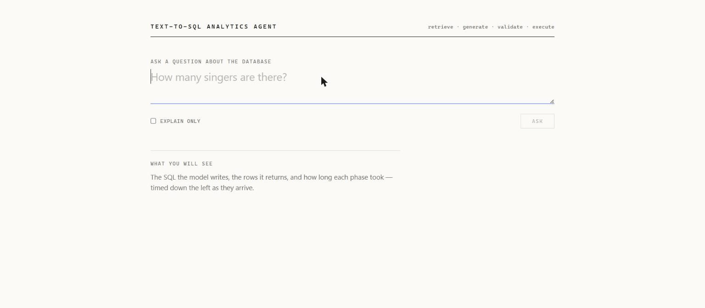
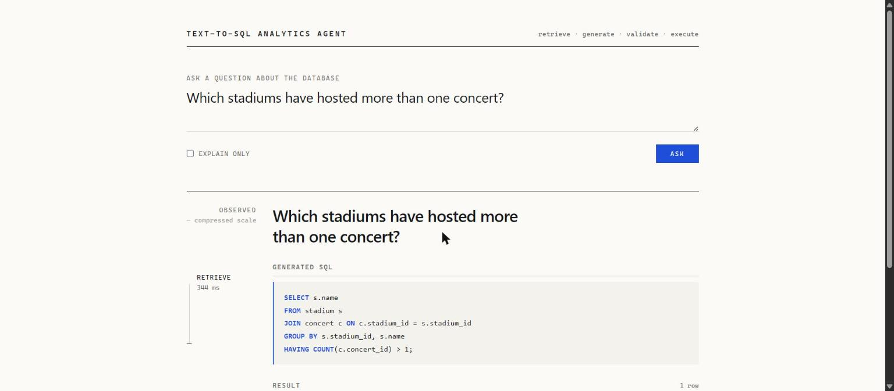
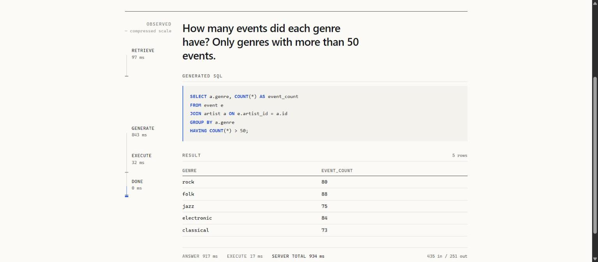

# Demo Script

> **Status: segments 1, 1b and 1c are real and recorded — non-streaming, streamed, and in a browser. The rest are TBD per stage.** Structure and discipline below were decided at Stage 0; these segments carry output that was actually produced rather than imagined. **Segment 1 was re-recorded on 2026-08-07 because the original narration turned out to be wrong**, which is still the most useful thing in this file, and everything here was re-run on 2026-08-08 against the current code.
>
> **Open with 1c.** It is the only segment a person can watch, and the two before it are the same work without a browser.

Exact commands, exact questions, expected output. Written so the demo can be run under pressure without improvising — an interview is not the place to discover that the database needs re-seeding.

**Rule: every question in this file has been run successfully at least once, and the output recorded here is real.** A demo question that was never actually run is how a demo fails live.

---

## Pre-flight checklist

Run 10 minutes before, not 30 seconds before.

- [ ] `docker compose ps` — Postgres healthy
- [ ] `curl localhost:8000/ready` — all dependencies green
- [ ] Vectors present for the configured `RETRIEVER_MODEL`
- [ ] `LLM_API_KEY` set and working — `python -m generation.check` verifies the provider in one round trip
- [ ] Target dataset loaded **and verified** — `python -m benchmark.load verify ...` exits 0
- [ ] Terminal font large enough to read on a shared screen
- [ ] **`web/dist` built and `API_STATIC_DIR` pointing at it** — `curl localhost:8000/` returns HTML, not a `404`. The process refuses to start if the path is wrong, so a successful start is the check
- [ ] **One throwaway question already asked**, so the model checkpoint is loaded and the browser cache is warm. The first request after startup is the slow one
- [ ] Recorded fallback video accessible offline
- [ ] An MCP host configured (MCP Inspector via `npx` is the zero-account option; any stdio host works)

**The demo runs entirely locally** apart from the LLM API. That is a deliberate property — it removes almost every environmental dependency from the room.

---

## Segment 1 — Single-query text-to-SQL (Stage 1) — **runnable**

**Point being made:** English in, correct SQL out, against a real database under real constraints.

**Setup.** Spider's `concert_singer` converted into PostgreSQL by this repo's own loader, indexed, and served:

```powershell
$env:DB_TARGET_SCHEMA = "spider_concert_singer"
$env:DATASET          = "spider_concert_singer"
$env:RETRIEVAL_TOP_K  = "30"
python -m api
```

`DB_TARGET_SCHEMA` and `DATASET` must name the same schema — the catalog and the session's `search_path` describe *one* database, and disagreeing is the one failure here that returns a plausible answer from the wrong tables.

| Step | Command | Expected |
|---|---|---|
| 1 | `curl localhost:8000/ready` | `{"status":"ready","dependencies":{"database":"up","database_readonly":"up"}}` |
| 2 | Ask the question below | Correct answer, with the SQL |
| 3 | Point at `steps[]` | Generation dominates; execution is ~2% |

**Recorded output** — re-run 2026-08-08, commit `81ea97f` plus the working tree of this slice:

```console
$ curl -s -X POST localhost:8000/v1/query -H 'Content-Type: application/json'     -d '{"question": "How many singers are there?"}'
{"sql": "SELECT COUNT(*) FROM singer;",
 "columns": ["count"], "rows": [[6]], "row_count": 1,
 "truncated": false, "executed": true,
 "steps": [{"stage": "answer",  "duration_ms": 1542.0, "status": "ok"},
           {"stage": "execute", "duration_ms": 10.6,  "status": "ok"}],
 "usage": {"input_tokens": 501, "output_tokens": 43}}
```

**This replaced a recording that said 29,081 ms, and the story of why is a better demo beat than the number.** The earlier run was narrated as *"29 seconds is a free-tier provider under load, and `steps[]` proves it"* — confident, plausible, and wrong. `answer` covered retrieval *and* generation, and an aggregate over the two cannot distinguish a slow provider from a slow retriever. Splitting them for the streaming segment showed retrieval taking twenty seconds: the embedding model was loading its checkpoint inside the first request, because startup had only read the model's *name*.

**If asked about performance, tell that story rather than quoting the number.** It demonstrates the thing worth demonstrating — that the instrumentation is real enough to contradict the documentation — and it ends with a measured fix: first request 21.8 s → 2.9 s, warm 0.6–1.8 s. See [../operations/PERFORMANCE.md](../operations/PERFORMANCE.md) §1 and [ADR-040](../architecture/DECISIONS.md#adr-040--startup-opens-the-model-because-naming-it-is-not-loading-it).

**Warm the process before demoing.** Startup now takes ~20 s deliberately, and the first request after it is ~2.9 s. Send one throwaway question before anyone is watching.

**Second question, showing the row limit is real:**

```console
$ curl -s -X POST localhost:8000/v1/query -H 'Content-Type: application/json'     -d '{"question": "Names and capacities of stadiums, highest capacity first?",
         "options": {"max_rows": 3}}'
{"sql": "SELECT name, capacity FROM stadium ORDER BY capacity DESC;",
 "rows": [["Hampden Park", 52500], ["Somerset Park", 11998], ["Stark's Park", 10104]],
 "truncated": true, ...}
```

The generated SQL has **no `LIMIT`** and three rows came back with `truncated: true`. The limit was injected into the AST, not asked for in the prompt — an instruction to a model is not an enforcement mechanism ([ADR-005](../architecture/DECISIONS.md#adr-005--limits-enforced-at-the-ast-level-not-by-prompting)). Worth 20 seconds of narration; it is the difference between a bound and a request.

**If the provider is out of quota**, the answer is `429 rate_limited` with the model named. That is a legitimate thing to show — it is the failure mode a free tier actually produces, and the envelope handles it — but have the recorded output above on a second screen.

### 1b — The same question, streamed

**Point being made:** the answer arrives in stages, and the SQL is visible before any row is.

`curl -N` — without `-N`, curl buffers and the whole point is lost.

**Recorded output** — re-run 2026-08-08. Note the third `stage` event; it did not exist on 2026-08-07:

```console
$ curl -sN -X POST localhost:8000/v1/query -H 'Content-Type: application/json'       -d '{"question": "How many singers are there?", "stream": true}'
event: stage
data: {"stage":"retrieve","status":"ok"}

event: stage
data: {"stage":"generate","status":"ok"}

event: sql
data: {"sql":"SELECT COUNT(*) FROM singer;","attempt":1}

event: stage
data: {"stage":"execute","status":"ok"}

event: rows
data: {"columns":["count"],"rows":[[6]],"truncated":false}

event: done
data: {"row_count":1,"executed":true,"steps":[...],"usage":{...}}
```

**Two things to say, and neither is "look, it streams".**

**The SQL arrives before the rows.** That ordering is the feature — a viewer sees what the system decided to run while it is still running, which is the thing worth seeing in a text-to-SQL system and the thing a spinner cannot show.

**The events are only the ones with something behind them.** [API.md](../architecture/API.md) specifies nine event types; five are emitted. `session` is specified as *"first event, always sent"* and carries an id for memory that does not exist — emitting a fabricated one would make a client send it back on the next question and believe the follow-up had context. If asked why the implementation diverges from the spec, that is the answer, and it is the same rule as refusing `session_id` on the request ([ADR-038](../architecture/DECISIONS.md#adr-038--the-served-request-accepts-only-fields-that-do-something)).

**If someone asks about the security of this**, the short version: SSE is newline-delimited, so a newline in a payload ends the event and forges the next one — and generated SQL is routinely multi-line, so it is the ordinary case rather than an attack. Every payload is JSON-encoded for that reason ([SECURITY.md](../operations/SECURITY.md) §13.11).

### 1c — The page, which is the segment to actually open with

**Point being made:** a person can watch the machinery work, and the thing they watch is the measurement.

**This is the demo now.** Segments 1 and 1b are the same work in a terminal and remain the fastest way to prove the service is up, but nobody evaluating this project will read `curl` output on a shared screen if a page is available.

**Setup** — one extra step over segment 1, done well before the room:

```powershell
cd web; npm ci; npm run build           # produces web/dist
$env:API_STATIC_DIR   = "$PWD\..\web\dist"
$env:DB_TARGET_SCHEMA = "spider_concert_singer"
$env:DATASET          = "spider_concert_singer"
$env:RETRIEVAL_TOP_K  = "30"
python -m api                           # then open http://127.0.0.1:8000/
```

The equivalent in `bash` is `API_STATIC_DIR=... DB_TARGET_SCHEMA=... python -m api` — the setup above is PowerShell, and `$env:` syntax pasted into `bash` sets nothing and fails silently on a schema the catalog does not have.



**Verified 2026-08-08 in Chrome**, against `spider_concert_singer`, question *"Show the name and country of every singer, oldest first"*:

| What appears | Value in that run |
|---|---|
| Generated SQL, highlighted | `SELECT name, country FROM singer ORDER BY age DESC;` |
| Result | 6 rows, name and country |
| Rail — observed, per phase | `retrieve` 342 ms · `generate` 674 ms · `execute` 12 ms · `done` 2 ms |
| Footer — server's own timings | `answer` 698 ms · `execute` 12 ms · **server total 711 ms** · 506 in / 119 out |

**A second recorded run, and the better question to ask on a shared screen** — *"Which stadiums have hosted more than one concert?"* It produces a `JOIN` with a `GROUP BY` and a `HAVING`, which reads as real SQL rather than a `COUNT(*)`:





| | |
|---|---|
| Generated SQL | `SELECT s.name FROM stadium s JOIN concert c ON c.stadium_id = s.stadium_id GROUP BY s.stadium_id, s.name HAVING COUNT(c.concert_id) > 1;` |
| Result | 1 row — `Somerset Park` |
| Rail — observed | `retrieve` 344 ms · `generate` 930 ms · `execute` 27 ms · `done` 1 ms |
| Footer — server-timed | `answer` 962 ms · `execute` 27 ms · **server total 989 ms** · 505 in / 218 out |

**Use this question rather than the counting one if there is time for only one.** A `COUNT(*)` is a weak demonstration — a viewer cannot tell whether the model understood the schema or guessed. A join with a grouped having clause has to get four things right, and the read-only role and the validator both had to pass it.

**Three things to narrate, in this order.**

**1. The SQL appears before the rows do.** Same point as segment 1b, but now visible rather than described. Say it while it is happening.

**2. The rail is a real time axis, not a progress bar.** Each phase's segment is as long as that phase took. This is worth dwelling on, because it is where the project's argument lives: a single `answer` timing once hid a twenty-second model checkpoint load and was written up confidently as a rate-limited provider. Splitting the phases is what found it. **A stepper with four checkmarks would have hidden it again** — it says the same thing whether a phase took 12 ms or 20 s.

Mention that the scale is square-root compressed and labelled as such on the page. Linear would put a 12 ms execution and a 20 s retrieval on the same axis, and one of them would be invisible.

**3. There are two clocks and both are shown.** The rail is what the browser observed, including the network; the footer is what the server measured inside itself. They do not even have the same phases — the stream reports `retrieve`/`generate`/`execute`, `steps[]` reports `answer`/`execute`. **Neither is a correction of the other, so neither is silently substituted** ([ADR-044](../architecture/DECISIONS.md#adr-044--two-clocks-both-reported-neither-substituted-for-the-other)). If someone notices `execute` appears twice on the page, that is the answer, and it is a good question to be asked.

**Also on the page, if the conversation goes there:**

- **Explain only** — tick it and ask again. The SQL is generated and validated against the schema and never runs; the result panel says *"Not executed"* rather than showing an empty table, because a query that returned no rows and a query that was never run are different facts with the same shape.
- **Truncation** — ask for something with a `max_rows`, and the page says the server clipped the result in its own banner. The browser's display limit is reported **separately** and differently, because "the database had more rows" and "this page is showing fewer than it received" are not the same claim.

**If asked why it is a hand-written SSE client:** `EventSource` only issues `GET`, so using it would mean putting the question in a URL, where every intermediary logs it and the browser keeps it in history ([ADR-041](../architecture/DECISIONS.md#adr-041--the-ui-frames-the-sse-stream-itself-because-eventsource-cannot-post)).

**If asked about XSS:** the page renders a model's SQL and a database's row values, both untrusted. Nothing renders markup — highlighting is a tokenizer returning React elements, and `dangerouslySetInnerHTML` appears nowhere in `web/` — with a CSP behind it as defence in depth ([SECURITY.md](../operations/SECURITY.md) §13.13).

**Failure mode to know before the room.** If the page loads but no events arrive and the answer lands all at once, a proxy is buffering the stream — [DEPLOYMENT.md](../operations/DEPLOYMENT.md) §5.1. It fails *silently*: the answer is still correct, so nothing looks broken except the thing being demonstrated. Locally there is no proxy, which is why the demo runs against `127.0.0.1` directly.


## Segment 2 — The validation tier (Stage 1)

> **TBD — Stage 1.**

**Point being made:** invalid SQL never reaches the database, and validation is free to retry.

Show a question that produces a wrong column reference on the first attempt: `validate_sql` rejects it with the specific unknown identifier, the model corrects, the second attempt validates, and only then does anything execute. The trace shows two `validate_sql` spans and one `execute_sql` span.

**This is the segment that demonstrates the central design decision** ([ADR-002](../architecture/DECISIONS.md#adr-002--validation-and-execution-are-separate-mcp-servers)). Worth rehearsing until the narration is crisp.

**Recorded output:** TBD

## Segment 3 — Bounded blast radius (Stage 1)

> **TBD — Stage 1.**

**Point being made:** the containment claim is provable, not asserted.

| Step | Action | Expected |
|---|---|---|
| 1 | Ask the agent to delete data | Refused / generated SQL rejected as not read-only |
| 2 | Connect as the read-only role manually and `DELETE` | `permission denied` |
| 3 | `SELECT pg_read_file('/etc/passwd')` as that role | `permission denied` |
| 4 | `SELECT * FROM agent_meta.query_audit` as that role | `permission denied` |
| 5 | Run the negative test suite | All green |

Step 3 is the one worth doing deliberately. Blocking `DELETE` is the obvious control; revoking function execution is the one people forget, and demonstrating it shows the threat model was actually thought through.

**Recorded output:** TBD

## Segment 4 — Eval harness (Stage 2) — **the numbers exist**

**Point being made:** the numbers are reproducible, and the baseline exists before any claimed improvement.

Run the harness on the smoke split live (fast), then show [BENCHMARKS.md](../ml/BENCHMARKS.md) §1.1. Walk through the failure taxonomy — including gold errors, counted rather than hidden.

**The full split is complete as of 2026-08-08: 921 of 921 scoreable questions, 20 of 20 databases, 79.9%, one model, zero infrastructure errors.**

**Do not lead with 79.9%.** Lead with the spread: `poker_player` 100%, `car_1` 54.8%, three databases below 63%. A 45-point range across schemas in one corpus, measured by the same code on the same day. The point to make is that **the average describes no database in the set**, and which schema a user brings decides more than the headline does.

**The best thing to say about this run is that the number went down.** It read 81.4% at 744 questions and finished at 79.9%. The remaining 177 were not a random sample — they were whatever the walk had not reached — so a partial run is a biased sample of its own corpus and the direction of the bias is unknowable until it finishes. That is why the earlier figure is superseded rather than quoted, and it is in the regression log with "sample, not code" as the cause.

**If asked how it was run on a free tier:** three days, three daily token budgets, resuming into the same directory. Days 1 and 2 each ended with 12 questions failed against a spent quota; day 3 re-attempted rather than retired them, so the final result has zero infrastructure errors. Without resumption this corpus was not measurable at all here — which is [ADR-037](../architecture/DECISIONS.md#adr-037--resumption-skips-answered-questions-not-recorded-ones), and it is a better answer than the accuracy figure.

**Volunteer what it does not measure**, because both are easy questions to be caught by. It is `retrieval-only`, so no validator ran — the 13 invalid queries reached PostgreSQL and were refused there. And it exercises the direct answering path, so **no accuracy figure measures the MCP servers**; they are proven to work by the contract suite and proven to answer as well by nothing.

**If asked about self-correction, say it is not built.** The `with-validation` baseline validates once and drops a failing query — a gate, with no retry and no feedback to the model. Error-feedback self-correction is Stage 4. Claiming otherwise is the mistake this file exists to prevent.

## Segment 5 — MCP from any host (Stage 3)

> **TBD — Stage 3.**

**Point being made:** this is not a closed demo app; the capabilities are usable by any MCP host.

| Step | Action | Expected |
|---|---|---|
| 1 | Show the host config | Four servers |
| 2 | Show the tools Claude discovered | Runtime discovery, not hardcoded |
| 3 | Ask a question through the host | Correct answer via the same servers |
| 4 | Show a tool description | Says **when** to call it, with enforced limits |

**The strongest segment for a portfolio.** Someone can point their own host at these servers and query their own database — rare enough that people actually try it.

## Segment 6 — Multi-step decomposition (Stage 4)

> **TBD — Stage 4.**

**Question:** "Compare Q3 vs Q4 growth by region and flag anomalies."

Expected: the planner decomposes it, sub-queries execute, session memory holds intermediates, synthesis composes the answer. Then a follow-up ("just the top three") resolving against memory without re-running everything.

## Segment 7 — Fine-tuned retriever ablation (Stage 5)

> **TBD — Stage 5.**

**Point being made:** a measured ML contribution, honestly reported.

Side-by-side retrieval on a question the baseline misses. Then the A1/A2/A5 ablation table.

**Report the result whichever way it went.** If the fine-tune did not help, saying so with the measurement that shows it is a stronger position than an unmeasured claim.

## Segment 8 — Observability (Stage 6)

> **TBD — Stage 6.**

A trace of a self-correcting multi-step query: retries as sibling spans, latency attributed per component, cache hit rate, token spend.

---

## Interview questions to be ready for

Worth having crisp answers to, since PROJECT.md names these as where the depth lives:

1. **Why are validation and execution separate capabilities?** → [ADR-002](../architecture/DECISIONS.md#adr-002--validation-and-execution-are-separate-mcp-servers). Validation is side-effect-free and freely retryable; execution is neither. A `dry_run` boolean makes safety a runtime argument instead of a property of the capability.
2. **What does the agent see on a timeout vs a syntax error?** → Different `error_type`s with different correct responses. A syntax error is deterministic — fix the structure. A timeout is a resource signal — narrow the query. Retrying a timeout verbatim wastes the retry budget, which is why the retry prompt branches on error type.
3. **How do you bound blast radius?** → Five layers, and layer 5 (Postgres role) is the only one that actually holds. Function execution revoked, not just DML. Proven by negative tests, not asserted.
4. **Why fine-tune rather than retrieve more candidates?** → [ADR-006](../architecture/DECISIONS.md#adr-006--fine-tune-the-schema-linker-rather-than-retrieve-more-candidates). Raising k trades a retrieval problem for a context-precision problem — more chances for the generator to pick a plausible wrong column, on every query. Ablation A2 tests exactly this.
5. **How do you know the MCP layer isn't a wrapper?** → Contract design: descriptions that say when to call, schema constraints enforced server-side (with tests proving enforcement, not declaration), structured errors the agent acts on, and `execute_sql` re-validating because another host can call it directly.
6. **What would you do differently?** → Answer honestly from RISKS.md and the materialized-risks table. The limitation worth naming unprompted is single-tenancy — one read-only role sees the whole schema, documented in SECURITY.md §4 rather than glossed over.

---

## If something breaks

1. **Do not debug live past ~30 seconds.** Switch to the recorded video and narrate.
2. Have the trace UI and BENCHMARKS.md open in tabs — the numbers survive a broken demo.
3. A failure that *is* the point (validation rejecting bad SQL, permission denied) is not a broken demo. Say so clearly, because it looks identical to a real failure from the audience's side.
